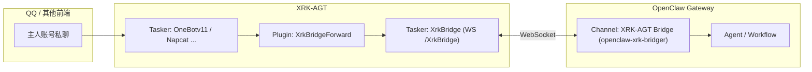

<div align="center">

# 🔗 Openclaw-Core

**XRK-AGT ↔ OpenClaw 的桥接核心：在 XRK-AGT 内部提供 WebSocket 桥接 Tasker + 插件，将“主人私聊”等受控消息安全地转发到 OpenClaw Agent，并将 Agent 回复回流到 QQ / 其他前端。**

[](https://github.com/sunflowermm/XRK-AGT)
[](https://github.com/sunflowermm/openclaw-xrk-bridger)
[](./LICENSE)

</div>

---

## 📦 项目定位

- **所在位置**：
  - 在 XRK-AGT 仓库内作为 Core 模块：`core/Openclaw-Core/`
- **职责**：
  - 在 XRK-AGT 侧提供 **WebSocket 服务端**（Tasker：`XrkBridge`）
  - 借助插件 `XrkBridgeForward` 只转发 **“主人私聊”等受控事件** 到 OpenClaw
  - 通过 `commonconfig/openclaw.js` + `data/openclaw/openclaw.yaml` 提供 **总开关与配置托管**

> ⚠️ 本 Core **不修改** XRK-AGT 的 `src/` 目录，仅依赖框架既有的 Loader / 基类 / 全局对象。

---

## 🗂️ 目录结构

```text
Openclaw-Core/
├── README.md
├── index.js                    # 入口，仅导出 Core 元信息
├── commonconfig/
│   └── openclaw.js             # 总开关配置（data/openclaw/openclaw.yaml）
├── default/
│   └── openclaw.yaml           # 默认配置模板（首次读取时复制到 data/openclaw/）
├── tasker/
│   └── XrkBridge.js            # 自定义 Tasker：WS 服务端 /XrkBridge
├── plugin/
│   └── XrkBridgeForward.js     # 主人私聊 → 转发到 XrkBridge → OpenClaw
└── OpenClaw-xrk-bridger/       # OpenClaw 侧通道插件（见下方 README 或独立仓库）
    ├── README.md
    ├── package.json
    ├── openclaw.plugin.json
    ├── tsconfig.json
    ├── src/
    └── dist/                   # 构建产物，需部署到 OpenClaw extensions
```

---

## ⚙️ 配置与启用

### 1. 配置文件路径

- **默认模板**：`core/Openclaw-Core/default/openclaw.yaml`
- **实际生效**：`data/openclaw/openclaw.yaml`
  - 由 XRK-AGT 的 commonconfig 系统在首次读取时自动从 `default/` 复制
  - 统一由 `global.ConfigManager` 管理

### 2. 关键字段

```yaml
# data/openclaw/openclaw.yaml
enabled: true
```

- `enabled: true`
  - 加载 `XrkBridge` Tasker
  - 启用 `XrkBridgeForward` 插件，监听“主人私聊”等事件并转发到 OpenClaw
- `enabled: false`
  - **不注册 Tasker / 插件**，当作未安装处理

> 修改配置后，重启 XRK-AGT 或触发配置热加载即可生效。

---

## 🔄 桥接链路一览



**XRK-AGT 侧：**

1. Napcat / OneBotv11 等协议接入 → 产生标准化 `message` 事件  
2. `XrkBridgeForward` 插件：
   - 在 `accept()` 中读取 `openclaw.enabled`
   - 过滤条件：`e.isPrivate && e.isMaster`（仅主人私聊等受控事件）
   - 通过内部桥接逻辑发到 `XrkBridge`
3. `XrkBridge` Tasker：
   - 在 `/XrkBridge` 路径上开启 WebSocket 服务端
   - 接收连接的 OpenClaw 插件
   - 将入站消息规范化后发给 OpenClaw，并等待回复
   - 将回复重新封装为 XRK 事件，调用 `e.reply()` 发回 QQ / 其他前端

**OpenClaw 侧：**

- 由 [`openclaw-xrk-bridger`](https://github.com/sunflowermm/openclaw-xrk-bridger) 作为 **WS 客户端** 连接 XRK-AGT
- 具体协议字段与 OpenClaw 配置，见该项目 README

---

## 🧱 与 XRK-AGT 框架的关系

本 Core 仅依赖 XRK-AGT 已有能力，不侵入基础设施层实现：

| 能力 | 说明 |
|------|------|
| **commonconfig 加载** | `src/infrastructure/commonconfig/loader.js` 扫描 `core/*/commonconfig/*.js`，加载 `openclaw.js` 并注册 key `openclaw`。 |
| **Tasker 加载** | `src/infrastructure/tasker/loader.js` 扫描 `core/*/tasker/*.js`，调用模块导出的 `register(bot)`；`XrkBridge.js` 内部根据 `openclaw.enabled` 决定是否注册到 `Bot.tasker`。 |
| **Plugin 加载** | `src/infrastructure/plugins/loader.js` 扫描 `core/*/plugin/*.js`；`XrkBridgeForward` 在 `accept()` 阶段读取 `openclaw.enabled`，为 `false` 时直接返回。 |
| **全局对象** | 使用 `Bot`、`global.ConfigManager`、插件基类 `plugin`，遵循 XRK-AGT 约定。 |

---

## 🔗 相关项目与链接

- **XRK-AGT 主项目**：[`XRK-AGT`](https://github.com/sunflowermm/XRK-AGT)
- **OpenClaw 侧通道插件**：[`openclaw-xrk-bridger`](https://github.com/sunflowermm/openclaw-xrk-bridger)

---

## 📄 许可证

本项目基于 **MIT License** 开源，详见 [LICENSE](./LICENSE)。
